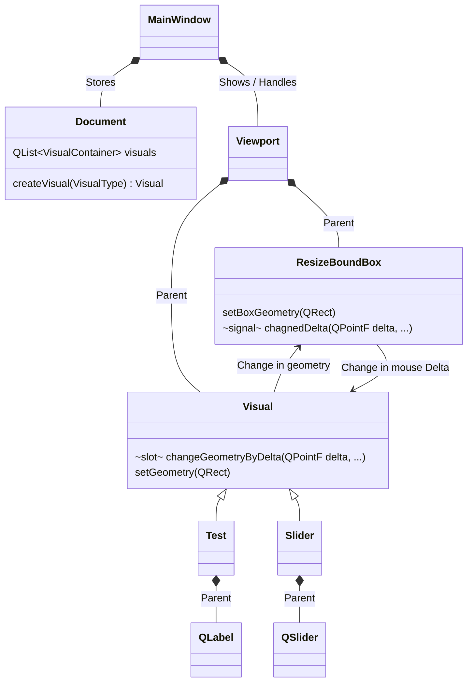

# Developer manuel

## Panels
The *Panel* is a fundamental concept of Skui.
It is organised the following way:

```mermaid
classDiagram
MainWindow *-- Document : Stores
Document : QList~VisualContainer~ visuals
Document : createVisual(VisualType) Visual

MainWindow *-- Viewport : Shows / Handles

Viewport *-- Visual : Parent
Visual : ~slot~ changeGeometryByDelta(QPointF delta, ...)
Visual : setGeometry(QRect)

Viewport *-- ResizeBoundBox : Parent
ResizeBoundBox : setBoxGeometry(QRect)
ResizeBoundBox : ~signal~ chagnedDelta(QPointF delta, ...) 

ResizeBoundBox <-- Visual : Change in geometry
ResizeBoundBox --> Visual : Change in mouse Delta

Visual <|-- Test
Test *-- QLabel : Parent

Visual <|-- Slider
Slider *-- QSlider : Parent
```